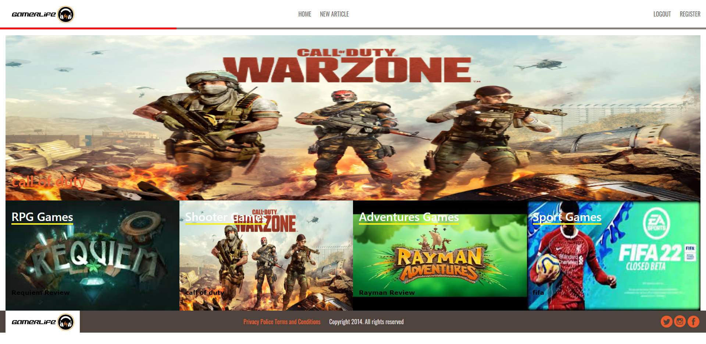

# Games Articles with ruby on rails

This is a blog app where you can write games articles and vote for articles created by another users.
This Ruby on rails Capstone Project is based on an life style blog. Following the desing of [liFEsTlye](https://www.behance.net/gallery/14554909/liFEsTlye-Mobile-version) (by Nelson Sakwa).

## Live Demo
[Live Demo Link](https://glacial-dawn-02646.herokuapp.com/)

## Built With

- Ruby v2.6.5
- Ruby on Rails v5.2.4

## Getting Started
- Fork the repository and create a local one on your computer
- Move to the repository inside the command line using `cd` and the path to the file
- Run `bundle install`, `rails db:migrate` and `rake db:seed` in that order
- Run `rails server`
- inside your browser go to http://localhost:3000/
- explore the application

## Instructions
- Create an account by clicking in Register, you do not need a password
- In the nav you can go to home or write an article
- In the home you can see the most voted article and the most recent article from each category.
- Create a new game article with the title, uploading an image, the body and choosing a category.
- You can vote for a article going to the category section.

## Authors

👤 **Yahir Cardona**

- Github: [@yahir91](https://github.com/yahir91)
- Twitter: [@YahirCardona3](https://twitter.com/YahirCardona3)
- Linkedin: [linkedin](https://www.linkedin.com/in/osmar-yahir-cardona-reyes-54b40b1a7/)

## 🤝 Contributing

Contributions, issues and feature requests are welcome!

Feel free to check the [issues page](issues/).

## Show your support

Give a ⭐️ if you like this project!
